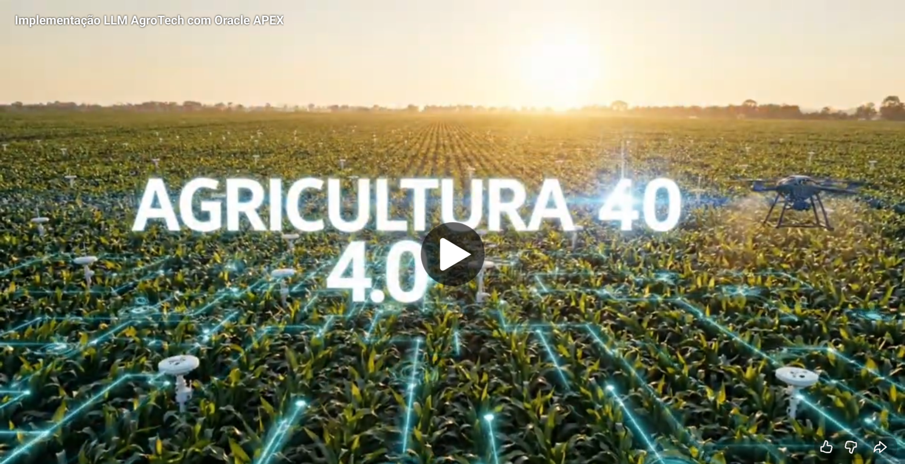

# AgroTech Challenge — Componente de Inteligência Artificial integrado ao Oracle APEX

Clique na imagem e confira o Vídeo LLM AgroTech com Oracle APEX

[](https://youtu.be/9X3xrN_2FdU?si=N_6H0ILW1U7rxnxZ)

## 1. Visão geral

O AgroTech é uma solução voltada ao monitoramento agrícola com sensores IoT em campo.  
No estado atual do projeto, os dados de sensores são capturados, transformados e persistidos em Oracle Database por meio do fluxo:

**Sensores → Broker MQTT → Node-RED → API .NET → Oracle Database**

Em paralelo, os dados cadastrais do domínio agrícola — como propriedade, campo e usuário — são tratados por uma **API Java** mantida por outro integrante da equipe.

O foco desta entrega é **definir e documentar o componente de Inteligência Artificial** que será integrado à aplicação **Oracle APEX**, incluindo:

- problema de IA;
- caso de uso;
- dados utilizados;
- modelo escolhido;
- fluxo entre APEX, Oracle Database e IA;
- estratégia de integração;
- roteiro de demonstração em vídeo.

---

## 2. Problema de IA definido

### Problema
O agricultor recebe dados técnicos de sensores, mas esses dados isolados não são suficientes para apoiar uma tomada de decisão rápida e compreensível.

### Solução proposta
O componente de IA do AgroTech será usado dentro do Oracle APEX para **transformar dados estruturados de sensores e de contexto agrícola em um diagnóstico inteligente em linguagem natural**, com:

- resumo da situação do campo;
- classificação de severidade;
- recomendação objetiva de ação.

### Exemplo de saída esperada
> “O Campo Norte apresenta risco hídrico moderado nas últimas 24 horas. A temperatura do ar permaneceu elevada, a umidade do solo apresentou tendência de queda e recomenda-se verificar a irrigação e realizar nova avaliação em 6 horas.”

---

## 3. Caso de uso principal

### Nome do caso de uso
**Diagnóstico inteligente do campo**

### Ator principal
- Agricultor
- Operador agrícola

### Entrada
- leituras de sensores armazenadas no Oracle Database;
- dados cadastrais do domínio agrícola vindos da API Java;
- regras de classificação configuradas pelo sistema.

### Processamento
1. O usuário seleciona propriedade/campo/talhão no Oracle APEX.
2. O APEX consulta os dados de sensores no Oracle Database.
3. O APEX consulta ou recebe os dados cadastrais da API Java.
4. O sistema consolida um contexto estruturado para análise.
5. Esse contexto é enviado ao componente de IA.
6. A IA devolve um diagnóstico textual e uma recomendação.

### Saída
- resumo da situação do campo;
- nível de atenção/severidade;
- recomendação textual para o agricultor.

### Valor de negócio
A solução reduz a necessidade de interpretação manual de dados técnicos e melhora a usabilidade do sistema para o usuário final.

---

## 4. Modelo de IA escolhido

### Modelo selecionado
**LLM (Large Language Model) com grounding em dados estruturados do Oracle Database e da aplicação APEX**

### Justificativa da escolha
O problema principal do AgroTech, neste momento, não é reconhecer imagens nem classificar textos livres.  
O desafio é **interpretar dados numéricos e contexto agrícola** e convertê-los em uma resposta clara para o usuário final.

Por isso, o modelo mais adequado para o MVP é um **LLM**, porque ele permite:

- resumir informações técnicas em linguagem natural;
- explicar situações de risco;
- gerar recomendações compreensíveis;
- responder de forma contextualizada com base em dados estruturados.

### Justificativa de não uso de outros modelos
- **CNN:** inadequada, pois o problema não envolve imagens.
- **Transfer Learning:** não é prioridade, pois não há uma base rotulada madura para ajuste supervisionado.
- **NLP clássico:** limitado para um cenário em que a principal entrada é numérica/estruturada, não textual.
- **ML supervisionado tradicional:** pode ser útil em fases futuras, mas exige histórico consolidado, dados rotulados e objetivo preditivo bem definido.

### Papel correto do LLM
O LLM **não substitui** a camada de dados do sistema e **não deve ser a única fonte da decisão numérica**.  
O papel dele é:

- interpretar;
- resumir;
- explicar;
- recomendar em linguagem natural.

---

## 5. Dados utilizados pela IA

## 5.1 Fontes de dados

### A. Dados de sensores
Origem:
- sensores em campo;
- broker MQTT;
- Node-RED;
- API .NET;
- Oracle Database.

Exemplos de variáveis já presentes:
- temperatura do solo;
- temperatura do ar;
- umidade do solo;
- umidade do ar;
- luminosidade;
- velocidade do vento;
- pH do solo;
- timestamp da leitura.

### B. Dados de cadastro/contexto
Origem:
- API Java do domínio agrícola;
- Oracle APEX;
- Oracle Database, quando houver sincronização ou persistência auxiliar.

Exemplos:
- propriedade;
- campo;
- talhão;
- usuário;
- associação entre área e sensores;
- cultura plantada.

### C. Dados derivados
Origem:
- consultas SQL, views ou lógica de negócio.

Exemplos:
- média das últimas 24 horas;
- mínimo e máximo;
- tendência de subida/queda;
- classificação de risco;
- recomendação-base parametrizada.

---

## 5.2 Formato de entrada para a IA

O componente de IA será alimentado por um **JSON estruturado**, montado pela camada APEX/Oracle a partir dos dados consolidados.

### Exemplo de payload

```json
{
  "propriedade": "Fazenda Boa Esperança",
  "campo": "Campo Norte",
  "talhao": "Talhão 3",
  "janela_analise": "24h",
  "leituras": {
    "temperatura_ar_media": 31.4,
    "temperatura_solo_media": 28.2,
    "umidade_ar_media": 42.0,
    "umidade_solo_media": 27.8,
    "luminosidade_media": 845,
    "velocidade_vento_media": 12.3,
    "ph_solo_medio": 5.9,
    "umidade_solo_tendencia": "queda"
  },
  "status_regras": {
    "risco_hidrico": "moderado",
    "condicao_solo": "atenção"
  }
}
```

---

## 5.3 Quantidade mínima necessária

Para o MVP com LLM, **não é necessário treinar um modelo próprio**.  
É necessário garantir contexto mínimo suficiente para a inferência.

### Quantidade mínima recomendada
- última leitura válida por sensor;
- agregação das últimas 24 horas;
- pelo menos temperatura do ar, umidade do ar, temperatura do solo e umidade do solo;
- identificação da área analisada.

### Quantidade ideal
- histórico de 24 horas e 7 dias;
- uso consolidado das sete variáveis atuais de sensores;
- associação clara entre sensor e campo/talhão;
- parâmetros de severidade por tipo de leitura;
- dados cadastrais consistentes.

---

## 6. Estratégia de integração com Oracle APEX e Oracle Database

## 6.1 Papel de cada componente

### Node-RED
Recebe os dados dos sensores, trata o payload e o envia para a API .NET.

### API .NET
Responsável exclusivamente pela ingestão e persistência de leituras de sensores no Oracle Database.

### API Java
Responsável pelos dados cadastrais do domínio agrícola, como propriedade, campo e usuário.

### Oracle Database
Responsável por armazenar os dados estruturados e servir de base de contexto para a IA.

### Oracle APEX
Responsável por:
- interface do usuário;
- orquestração da consulta;
- montagem do contexto;
- acionamento do componente de IA;
- exibição da resposta.

### Componente de IA
Responsável por transformar contexto estruturado em:
- diagnóstico textual;
- severidade;
- recomendação em linguagem natural.

---

## 6.2 Estratégia técnica recomendada

A estratégia recomendada para o Challenge é:

1. **Oracle Database** armazena as leituras de sensores.
2. **Oracle APEX** consulta o banco para obter os dados técnicos.
3. O APEX também consulta, diretamente ou por REST, os dados cadastrais necessários.
4. O sistema monta um contexto estruturado.
5. O APEX envia esse contexto ao componente de IA.
6. O retorno da IA é apresentado na interface ao agricultor.

### Integração recomendada
- **APEX + Oracle Database** como base de dados e interface;
- **REST Data Sources** no APEX quando for necessário consumir APIs externas;
- **REST Enabled SQL / ORDS** quando houver necessidade de acesso remoto a Oracle Database;
- **OCI Generative AI Agents** como opção preferencial no ecossistema Oracle para o componente LLM ???.

### Decisão arquitetural do componente de IA
**Decisão recomendada:** usar um **LLM integrado por API/REST**, com prioridade para o ecossistema Oracle.

Se o grupo optar por OCI:
- usar **OCI Generative AI Agents**.

Se o grupo optar por POC mais simples:
- usar outro serviço de LLM via REST ???.

---

## 7. Fluxo de funcionamento dentro do sistema

### Passo a passo funcional
1. O usuário acessa o Oracle APEX.
2. O usuário seleciona uma propriedade, campo ou talhão.
3. O APEX consulta os dados de sensores no Oracle Database.
4. O APEX consulta os dados de cadastro necessários.
5. O sistema calcula ou consolida indicadores relevantes.
6. O APEX monta um JSON estruturado.
7. Esse JSON é enviado ao componente de IA.
8. A IA interpreta o contexto e gera:
   - resumo;
   - nível de severidade;
   - recomendação textual.
9. O APEX exibe o resultado ao usuário.
10. Opcionalmente, o sistema registra a análise realizada para auditoria ???.

---

## 8. Demonstração funcional sugerida

A apresentação pode mostrar:
- Node-RED recebendo ou simulando dados de sensores;
- API .NET recebendo o payload;
- Oracle Database com dados persistidos;
- Oracle APEX consumindo dados;
- exemplo de resposta da IA;
- diagrama da arquitetura;
- exemplo de payload enviado ao modelo.

### Cenário sugerido para o vídeo
- temperatura do ar elevada;
- umidade do solo em queda;
- velocidade do vento em nível de atenção;
- classificação de risco hídrico moderado;
- recomendação gerada em linguagem natural.

---

## 9. Limitações e riscos

### Limitações
- o LLM não substitui especialista agronômico;
- a qualidade da resposta depende da qualidade dos dados;
- sem histórico consistente, a IA será mais explicativa do que preditiva.

### Riscos
- inconsistência entre dados de sensores e dados cadastrais;
- associação incompleta entre sensor e área;
- respostas genéricas se o contexto enviado ao modelo for pobre.

### Mitigações
- enviar contexto estruturado e não apenas texto livre;
- aplicar regras e agregações antes da chamada à IA;
- registrar respostas para auditoria;
- restringir a IA ao papel de interpretação e comunicação.

---

## 10. Evolução futura

Em fases futuras, o projeto pode evoluir para:
- classificação automática de anomalias;
- previsão de risco hídrico;
- recomendação preditiva com base em histórico;
- uso de Oracle Machine Learning em ambiente Autonomous AI Database;
- combinação de regras + ML + LLM.

### Estratégia de evolução
- **Fase 1 (atual):** LLM para interpretação e explicação.
- **Fase 2:** modelos preditivos com histórico rotulado.
- **Fase 3:** recomendação híbrida baseada em regras, machine learning e LLM.
